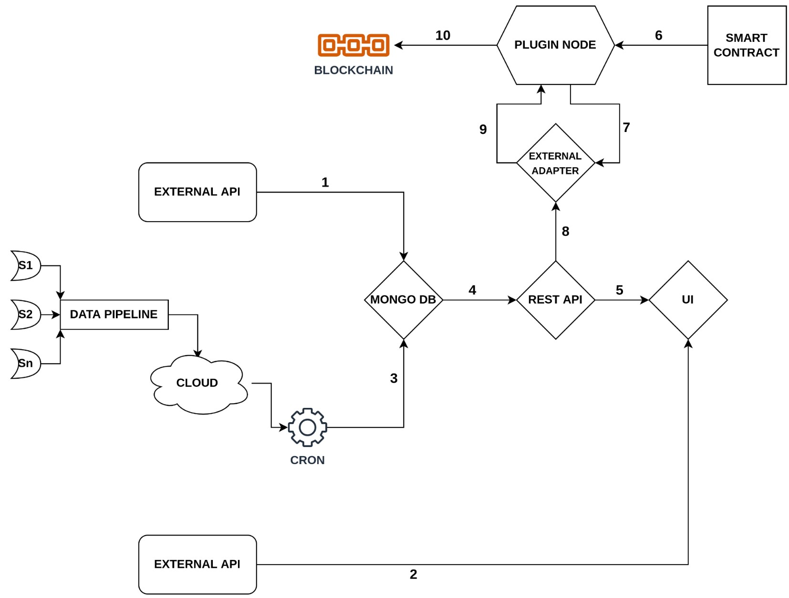

# Blockchain Enabled Real-Time Air Pollution Tracking and Tracing Application

### TEAM 
1) Nandan Ganginani https://www.linkedin.com/in/nandan-ganginani-a9a961155/
2) Sneha Sameera M https://www.linkedin.com/in/sneha-sameera-m-116611115/
3) Prudhvi Krishna M https://www.linkedin.com/in/mpkmba/

We represent Inclusive Growth Chain.

### Youtube Link for Video Presentation
* https://youtu.be/weuWWjzQtIw

### Power Point Presentation
* https://docs.google.com/presentation/d/19QruHHPfqXiNLG67aQRJYsIiVG_NrhNx/edit?usp=sharing&ouid=100557699563820432896&rtpof=true&sd=true

## Inspiration
  The Ultimate T2T Hybrid Hackathon - 2022 - Powered By PLI & XDC

## Inclusive Growth Chain

## Steps to Install and Setup
* Clone the repositories https://github.com/GoPlugin/plugin-deployment.git and https://github.com/GoPlugin/external-initiator.git using git clone command.
* Install Plugin node and setup External initiator using script method.
* Setup the External Initiator.
* Deploy Oracle contract using Remix IDE.
* Create job to the plugin node to test the connection between oracle and external world.
* Setup XDC pay as chrome extension or setup Xinfin-Test Network in Metamask.
* Obtain XDC and PLI for testing 
## Node Installation
* We execute below commands for node installation.
  * `git clone https://github.com/GoPlugin/plugin-deployment.git`
  * `cd plugin-deployment`
* We create two files .env.apicred and .env.password with appropriate credentials.
* We then trigger the bash file using the command
  * `./1_prerequisite.bash`
* After updating credentials in 2_nodeStartPM2.sh file we execute below command to start the node.
  * `pm2 start 2_nodeStartPM2.sh`
## External Initiator Setup
* We execute below commands to External Initiator
  * `git clone https://github.com/GoPlugin/external-initiator.git`
  * `cd external-Initiator`
  * `. ~/.profile`
  * `go install`
* To initiate the initiators using plugin we execute the below commands.
  * `plugin admin login`
  * `plugin initiators create xdc-test http://localhost:8080/jobs`
* We then create startEI.sh file with appropriate Keys.
* We execute the below command to start the external initiator
  * `pm2 start startEI.sh`

## IGC UI

## UI Features
* Selection of Location
* Map and AQI Loading
* Individual Pollution Description/country ranges
* Health Recommendation
* Sources of Pollutants
* Effect of Pollutants
* Blockchain Functionality

## Challanges & Implementations
* Scales for different countries:
  * Each country defines its own scales in aqi about what level is good, what level is moderate, what level is dangerous. To solve this we went through each countries scales and made the scale in the UI Dynamically load to their respective country.
* Different Unit systems, unit conversion:
  * Like the scales the units were defined different for each country. We had to go through the formulas for conversion.
* Map API Issues : 
  * Signing up for google’s map API had different complications. There are lot of permutations to go through to select the required API.
* Coordinate collection: 
  * Had to manually go through the locations and get the coordinates for all the 120 selections for the map to be loaded.

## Build With
* Solidity, MetaMask, Web3js, Shell script.

## Future Enhancements
* Add blockchain features topush the data, to deploy clients smart contract.
* To install more devices in multiple locations to get accurate information and to improve data granularity.
* Follow a business model that is more scalable than a volunteer based one incentivizing the targeted people.
* Add more sophesticated features in UI that add more functionality and give more information.
* To predict future data using Machine Learning models with accurate real time data.

## Note
* After extracting the downloaded zip file, go to terminal of project folder and type 'npm install' command to install node modules.
